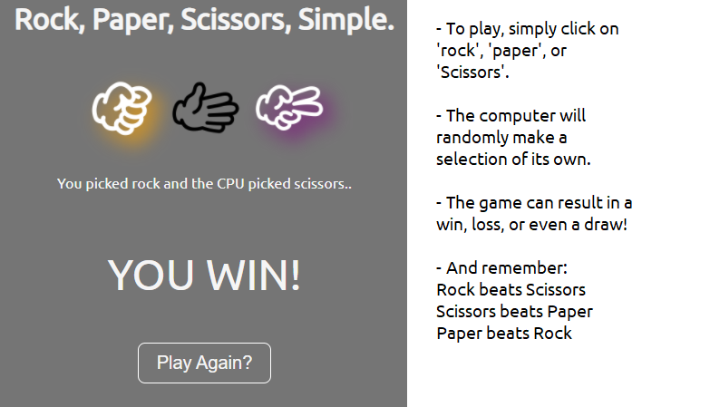

# A simple Rock-Paper-Scissors game.

 ### A simple take on the classic Rock-Paper-Scissors game.

#### Check it out [here](https://btarro.github.io/rock-paper-scissors)

 

## Summary
This game was written using basic HTML, CSS, and JavaScript (no libraries). My intention was for this project to keep the same simple aesthetic as my previous projects, but I did add a bit of CSS image filtering for a dab of color. 

In the future I'd like to shift this project to take advantage of HTML canvas with a touch of animation.

## Author
Bruce Tarro - Full Stack Developer [LinkedIn](https://www.linkedin.com/in/bruce-tarro/) | Personal Website - comming soon